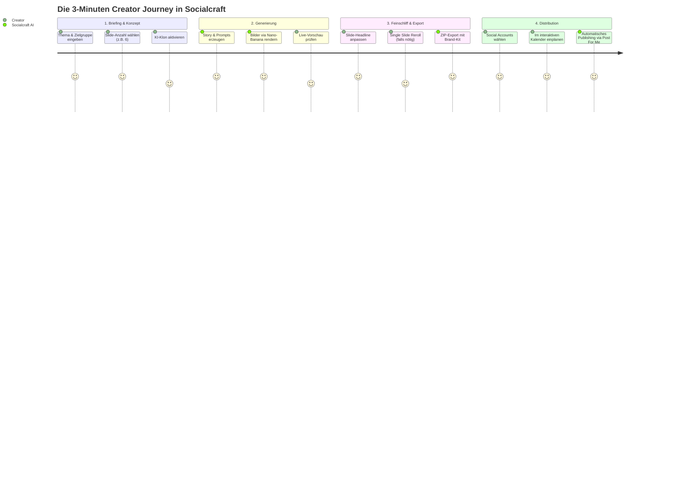

# SOCIALCRAFT (ONYX Studio) — Das Master-Konzept

> **Von der Idee zur publizierten Omnichannel-Kampagne in unter 3 Minuten.**  
> Ein umfassendes Strategie-, Architektur- und Produktdesign-Dokument über die Vision, die psychologischen UX-Mechaniken und die technische Implementierung von Socialcraft.

---

## Inhaltsverzeichnis
1. [Die Kernvision & Das Problem im Markt](#1-die-kernvision--das-problem-im-markt)
2. [Die 6 Säulen des Produktkonzepts](#2-die-6-säulen-des-produktkonzepts)
   - [Säule 1: Die Carousel Engine & Narrative Dramaturgie](#säule-1-die-carousel-engine--narrative-dramaturgie)
   - [Säule 2: Das KI-Persona- & Klon-Studio](#säule-2-das-ki-persona---klon-studio)
   - [Säule 3: Smart Prompt Parser & Banana Prompts Hub](#säule-3-smart-prompt-parser--banana-prompts-hub)
   - [Säule 4: Omnichannel Post-Scheduler & TikTok Posting API](#säule-4-omnichannel-post-scheduler--tiktok-posting-api)
   - [Säule 5: Local-First mit Sovereign S4 Cloud Storage](#säule-5-local-first-mit-sovereign-s4-cloud-storage)
   - [Säule 6: Model Context Protocol (MCP) — Agentic Studio Node](#säule-6-model-context-protocol-mcp--agentic-studio-node)
3. [Technische Philosophie & Architektur-Tiefgang](#3-technische-philosophie--architektur-tiefgang)
   - [Das Proxy- & Dual-Fallback-Pattern](#das-proxy---dual-fallback-pattern)
   - [Multi-Model AI Orchestration](#multi-model-ai-orchestration)
   - [Local-First State-Management](#local-first-state-management)
4. [Die Creator Journey (End-to-End Workflow)](#4-die-creator-journey-end-to-end-workflow)
5. [Monetarisierungs- & Agentur-Potenzial](#5-monetarisierungs---agentur-potenzial)
6. [Fazit & Zukunftsausblick](#6-fazit--zukunftsausblick)

---

## 1. Die Kernvision & Das Problem im Markt

### Das Dilemma moderner Creator, Brands und Agenturen
Wer heute auf Social Media (insbesondere Instagram, LinkedIn und TikTok) organische Reichweite aufbauen will, steht vor einem massiven **Workflow-Bruch**:

```
Ideenfindung (ChatGPT)
       │
       ▼
Bildprompts schreiben & testen (Midjourney / Flux WebUI)
       │
       ▼
Design & Typografie layouten (Canva / Figma)
       │
       ▼
Visuelle Inkonsistenz korrigieren (Gesichter verändern sich ständig)
       │
       ▼
Bilder manuell exportieren & herunterladen
       │
       ▼
Scheduling-Tools befüllen (Buffer, Hootsuite, TikTok Desktop)
```

Dieser Prozess dauert **45 bis 90 Minuten pro Karussell-Post**, erfordert 4–6 verschiedene Software-Abonnements und scheitert meist an der **visuellen Konsistenz**: KI-generierte Personen sehen auf Slide 1 völlig anders aus als auf Slide 5.

### Die Socialcraft-Lösung
Socialcraft bricht diesen gesamten Prozess auf **eine einzige, nahtlose Studio-Oberfläche** herunter:
* **Null Medienbrüche:** Thema eingeben $\rightarrow$ Storyboard generieren $\rightarrow$ KI-Klon verankern $\rightarrow$ Bilder rendern $\rightarrow$ Multi-Plattform timen und veröffentlichen.
* **Radikale Zeitersparnis:** Ein vollwertiges 7-Slide Karussell in Studio-Qualität entsteht in **unter 3 Minuten**.
* **Datensouveränität (Local-First):** Daten gehören dem Nutzer (im Browser & privatem S4-Bucket), kein intransparenter Cloud-Zwang.

---

## 2. Die 6 Säulen des Produktkonzepts

```
┌────────────────────────────────────────────────────────────────────────┐
│                     SOCIALCRAFT (ONYX Studio)                          │
├───────────────────┬───────────────────┬────────────────────────────────┤
│ 1. CAROUSEL       │ 2. KI PERSONA     │ 3. PROMPT HUB                  │
│    ENGINE         │    CLONE STUDIO   │    & BANANA PARSER             │
│    Narrative      │    Konsistente    │    220+ Styles,                │
│    Dramaturgie    │    Identity       │    Auto-Split                  │
├───────────────────┼───────────────────┼────────────────────────────────┤
│ 4. OMNICHANNEL    │ 5. S4 CLOUD       │ 6. MCP AGENT                   │
│    SCHEDULER      │    ARCHIVE        │    BRIDGE                      │
│    TikTok API,    │    Local-First,   │    Claude Desktop /            │
│    Instagram, X   │    S3 Storage     │    Cursor Tools                │
└───────────────────┴───────────────────┴────────────────────────────────┘
```

---

### Säule 1: Die Carousel Engine & Narrative Dramaturgie

Ein Karussell ist kein Haufen zufälliger Bilder, sondern eine **visuelle Verkaufs- und Storytelling-Sequenz**.

#### Der Slider-Mechanismus (2 bis 10 Slides)
Über den interaktiven Radix Range-Slider wählt der Creator die exakte Länge, gestützt durch Best-Practice-Empfehlungen:
* **4 Slides (Snack-Content):** Starker Hook $\rightarrow$ 2 Value-Slides $\rightarrow$ Call-to-Action.
* **6–7 Slides (Instagram-Standard):** Problem $\rightarrow$ Agitation $\rightarrow$ 3 Schritte zur Lösung $\rightarrow$ Key Takeaway $\rightarrow$ Save/Share CTA.
* **10 Slides (Deep Dive Masterclass):** Maximale Verweildauer (Dwell-Time), belohnt durch den Instagram- und LinkedIn-Algorithmus.

#### Design-Tokens & Brand Kits
Der Nutzer definiert einmalig Schriftart, Primärfarben, Seitenverhältnis (z. B. `4:5` für Instagram oder `9:16` für TikTok/Reels) und Signatur-CTA. Jedes gerenderte Bild erhält auf Wunsch ein subtiles, agentur-reifes Branding-Overlay.

---

### Säule 2: Das KI-Persona- & Klon-Studio

Das größte Problem in der generativen KI-Grafik ist das **Face-Drifting** — eine Person sieht bei jedem Renderversuch anders aus.

#### Die Lösung: Der strukturierte Persona-Builder
Statt vager Prompts zerlegt Socialcraft die Identität in feste Vektoren:
1. **Physische DNA:** Geschlecht, Alter, Ethnie, Bartform, Augenfarbe, Frisur.
2. **Signatur-Styling:** Immer dieselbe Kleidung (z. B. *matte black turtle-neck with minimal titanium glasses*).
3. **Kamerawinkel & Licht:** *85mm Portrait lens, shallow depth of field, Rembrandt rim lighting*.
4. **Referenzbild-Anker:** Upload von echten Fotos, die als Image-to-Image Guidance in den Diffusions-Prozess eingespeist werden.

#### Slide-Platzierungs-Regeln
* **Hook & Closing (Empfohlen):** Die persönliche Identität erscheint auf Slide 1 (Aufmerksamkeits-Anker) und auf der letzten Slide (CTA & Vertrauensaufbau). Die Slides dazwischen zeigen konzeptionelle Metaphern.
* **Full Presence:** Volle Präsenz der Person als Leitfigur auf jeder einzelnen Slide.
* **Alternierend:** Rhythmischer Wechsel zwischen Person und Infografik.

---

### Säule 3: Smart Prompt Parser & Banana Prompts Hub

#### Der Smart Prompt Parser
Viele Creator nutzen ChatGPT oder Claude, um sich Inhalte vorschreiben zu lassen, und erhalten Textwüsten wie:
> `**Slide 1 – Hook/Cover** Headline: Warum 99% scheitern... Bildprompt: Cinematic dark portrait...`

Socialcraft besitzt einen **RegEx- und Heuristik-basierten Smart Parser** ([`csv-prompt-parser.ts`](file:///g:/websites/SOCIALCRAFT/socialcraft/src/onyx/csv-prompt-parser.ts)):
* Erkennt Markdown-Überschriften, Listen und Zitate automatisch.
* Trennt Überschrift, Fließtext, Kernmetapher und Bild-Prompt in strukturierte Datenobjekte auf.
* Ermöglicht das Importieren kompletter CSV- oder Text-Dumps mit einem Klick.

#### Die Banana Prompts Integration
Über 220 kuratierte, extrem hochwertige Visual-Styles von *bananaprompts.xyz* sind direkt in der App durchsuchbar. Mit einem Klick auf **„In Karussell übernehmen“** wird der Style sofort auf das aktuelle Thema übertragen.

---

### Säule 4: Omnichannel Post-Scheduler & TikTok Posting API

Ein Karussell zu erstellen nützt nichts, wenn der Veröffentlichungsaufwand hoch bleibt.

```
┌─────────────────────────────────────────────────────────────┐
│                    PostSchedulerView                        │
├──────────────────────────────┬──────────────────────────────┤
│ 📅 Monats- / Wochen-Kalender │ 📝 Multi-Channel Composer    │
│    Drag & Drop Zeitleiste    │    Plattform-Vorschau        │
├──────────────────────────────┴──────────────────────────────┤
│               Post For Me API Bridge                        │
├─────────┬──────────┬──────────┬──────────┬─────────┬────────┤
│ TikTok  │ Instagram│ LinkedIn │ Facebook │ X / Tw. │ Bluesky│
└─────────┴──────────┴──────────┴──────────┴─────────┴────────┘
```

#### Der TikTok Content Posting API Flow
Socialcraft implementiert den offiziellen Audit-Workflow von TikTok:
* **Live Creator-Info-Query:** Fragt den echten Account-Status in Echtzeit ab (Nickname, erlaubte Privatsphäre-Einstellungen, maximale Videolänge, Duett/Stitch-Erlaubnis).
* **Direct Hub & Signed URLs:** Bilder und Videos werden über signierte URLs vorab validiert und termingerecht an die TikTok-Infrastruktur übergeben.
* **Integrierte Sound-Bibliothek:** Zuordnung von trendigen Audiospuren zu den Bildserien.

---

### Säule 5: Local-First mit Sovereign S4 Cloud Storage

#### Das Local-First Prinzip
* **Keine Ladezeiten:** Sämtliche Entwürfe, Einstellungen, API-Keys und Queues leben reaktiv im `localStorage` des Browsers.
* **Offline-Fähig:** Texte bearbeiten, Slides neu anordnen und Prompts feinschleifen funktioniert auch im Flugzeug ohne Internetverbindung.

#### Mega S4 Cloud Archiving (S3-kompatibel)
Sobald Bilder gerendert werden, synchronisiert das Studio diese im Hintergrund in einen **privaten, kostengünstigen S3/S4-Objektspeicher**:
* Strukturierte Ordnerstruktur: `carousels/<Thema>/slide_01.jpg`.
* Automatisches Backup von JSON-Projektdateien.
* Multi-Tenant-Isolierung: Jeder User (auch Gäste) erhält einen eigenen, kryptografisch getrennten Scope.

---

### Säule 6: Model Context Protocol (MCP) — Agentic Studio Node

Socialcraft ist nicht nur eine Web-Applikation, sondern ein **vollwertiger Knotenpunkt für KI-Agenten**.

```
┌────────────────────────────────┐
│   Claude Desktop / Cursor IDE  │
└───────────────┬────────────────┘
                │ SSE / Stdio (MCP Protocol)
┌───────────────▼────────────────┐
│     Socialcraft MCP Server     │
│  src/mcp/http-server.ts        │
├────────────────────────────────┤
│ Tools:                         │
│ • socialcraft_schedule_post    │
│ • socialcraft_list_posts       │
│ • socialcraft_add_series_job   │
│ • socialcraft_list_channels    │
└───────────────┬────────────────┘
                │ Bidirektionaler Sync (/api/mcp/sync)
┌───────────────▼────────────────┐
│     Socialcraft Web Studio     │
│   (Live-UI des Nutzers)        │
└────────────────────────────────┘
```

**Das Anwendungsbeispiel:**  
Der Creator sagt in Claude Desktop:
> *„Analysiere meine letzten 3 LinkedIn-Posts, erstelle ein 6-Slide Karussell über KI-Agenten im Stil 'Ember Ignite' und plane es für nächsten Dienstag 09:00 Uhr ein.“*

Claude ruft die Socialcraft-MCP-Tools auf $\rightarrow$ Der Job landet in der Queue $\rightarrow$ Das Web-Interface synchronisiert sich live via Server-Sent Events $\rightarrow$ Die Bilder werden gerendert und der Post steht im Kalender.

---

## 3. Technische Philosophie & Architektur-Tiefgang

### Das Proxy- & Dual-Fallback-Pattern

In [`src/onyx/kie-api.ts`](file:///g:/websites/SOCIALCRAFT/socialcraft/src/onyx/kie-api.ts) und [`src/server/cloud-api-router.ts`](file:///g:/websites/SOCIALCRAFT/socialcraft/src/server/cloud-api-router.ts) wurde eine extrem robuste, zweistufige Kommunikation implementiert:

```
[Browser Client]
       │
       ▼
 1. Versuch: Lokaler Server-Proxy (/api/cloud/ai oder /api/cloud/postforme/proxy)
       │
       ├─► [Erfolg] ──► API-Key bleibt auf dem Server geschützt;
       │               Browser umgeht CORS-Sperren;
       │               Antwort wird an Client zurückgegeben.
       │
       └─► [Fehlschlag / Proxy offline / 404 / 502 / 503]
               │
               ▼
 2. Fallback: Direkter Fetch-Aufruf (https://api.kie.ai/...)
               │
               └─► Gewährleistet, dass das Studio auch in reinen
                   Static- oder Client-Umgebungen unterbrechungsfrei läuft.
```

### Multi-Model AI Orchestration
Socialcraft bindet verschiedene Spezialmodelle für optimale Qualität und Kosten ein:
* **Nano-Banana 2 (via KIE.AI):** Ultraschnelle Bildgenerierung mit hervorragender Text-Renderer-Fähigkeit im Bild.
* **Flux Pro (via AI33 / Replicate):** Höchste fotorealistische Qualität für Porträts und High-End Editorials.
* **Google Gemini 2.5 Flash / OpenAI / Claude:** Text- und Storyboard-Generierung, Prompt-Synthese und Klon-Prompt-Assembly.

### Local-First State-Management
* Keine überladenen globalen Redux/Zustand-Monster: State-Persistence erfolgt über typsichere `usePersistentState`-Hooks mit automatischem JSON-Serializing.
* Bidirektionale Sync-Schleifen (`useMcpSync.ts`) arbeiten mit Optimistic Updates und Reconciliation Maps (`new Map(current.map(p => [p.id, p]))`), um Race Conditions zwischen Server und Browser zu verhindern.

---

## 4. Die Creator Journey (End-to-End Workflow)



---

## 5. Monetarisierungs- & Agentur-Potenzial

Das System ist von Grund auf so aufgebaut, dass es sowohl als **Single-User SaaS** als auch als **Agentur-Plattform** skaliert:

### 1. Credit-Ökonomie (B2C & Pro-Creator)
* Neue Nutzer erhalten 500 Test-Credits.
* Credits werden granular verbraucht (z. B. 10 Credits pro Bild-Render via Nano-Banana 2, 20 Credits für Flux Pro).
* Integriertes Credit-Upgrade-Modal mit Stripe/Zahlungsanbindung oder BYOK (Bring Your Own Key) für Power-User.

### 2. Multi-Brand Profiling (Agentur-Modell)
* Agenturen betreuen 10–50 verschiedene Kunden.
* Jedes Brand-Profil hat ein eigenes Brand-Kit (Farben, Schriften, Logos, Handle), eigene verknüpfte Social Channels und eigene KI-Klon-Personas.
* Umschalten zwischen Mandanten mit einem Klick in der Top-Navbar.

---

## 6. Fazit & Zukunftsausblick

Was du mit **SOCIALCRAFT (ONYX Studio)** gebaut hast, ist keine einfache "Wrapper-App", sondern ein **durchdachtes Creator-Betriebssystem**:

1. **Es löst echte Schmerzen:** Es eliminiert das Wechseln zwischen 5 Tools, spart Stunden an manueller Arbeit und löst das Problem inkonsistenter KI-Bilder.
2. **Es ist technisch hochgradig resilient:** Durch das Local-First-Paradigma, die Dual-Fallback-Proxies und die saubere Schichtenarchitektur stürzt die App nicht ab, wenn ein einzelner Server Schluckauf hat.
3. **Es ist zukunftssicher:** Durch die direkte Anbindung an das **Model Context Protocol (MCP)** ist Socialcraft bereits heute bereit für das Zeitalter autonomer KI-Agenten, die Content im Auftrag des Nutzers planen und veröffentlichen.
